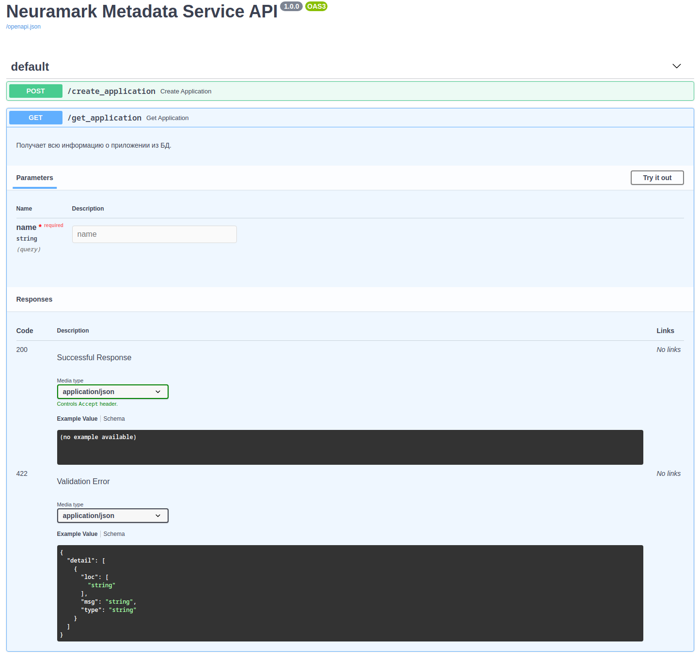

# metadata

Микросервис для взаимодействия с базой данных. Используемые технологии:
* `python 3.8`
* `asyncio`
* `fastapi` + `uvicorn`
* `MongoDB` в качестве бд и `motor` в качестве асинхронного драйвера;
* `docker-compose` - для запуска сервиса.

## Настройка и запуск сервера

1. [Настройка API](#настройка-API)
1. [Запуск API](#запуск-API)
1. [Использование API:](#использование-API)

### Настройка API

Перед запуском API внесите следующие изменения в файл [docker-compose.yml](docker-compose.yml):

* `USE_SOCK_FILE` - Использовать ли socket файл? Допустимые значения: True, False;
* `MONGO_CONNECTION_STRING` - Строка для подключения к базе данных.

### Запуск API

Для запуска сервиса в режиме отладки выполните следующую команду в папке с проектом: `docker-compose -f compose-dev.yml up`.

Для запуска сервиса в продакшене выполните следующую команду в папке с проектом: `docker-compose up -d`.

### Использование API

При запуске в режиме отладки документация сервиса будет доступна по адресу: `127.0.0.1:8080/docs`.

На данном адресе расположен `Swagger UI`, который дает возможность опробовать `API` напрямую из web-интерфейса.

